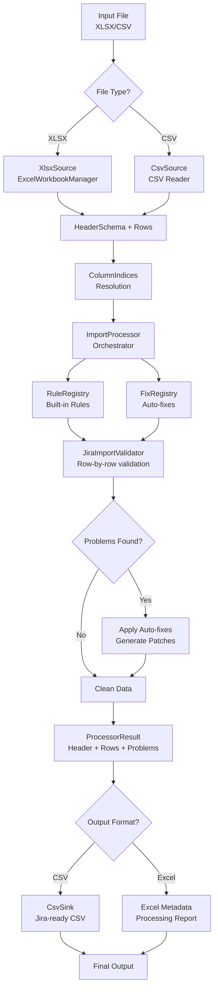
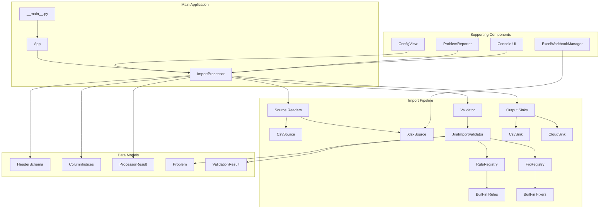
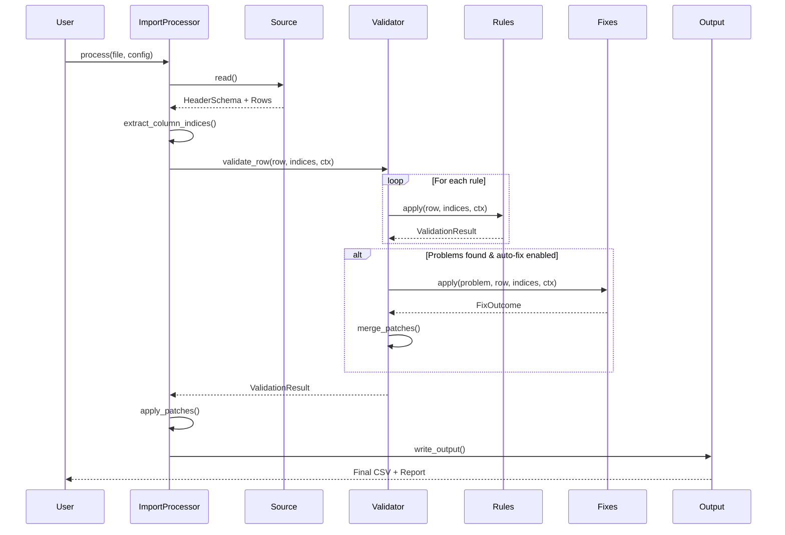
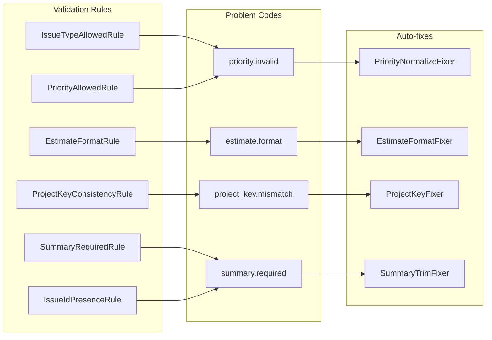

# Architecture Guide

This doc gives you the lowdown on how the Jira Importer Toolkit is put together, including visual diagrams and component breakdowns.

## 📁 Repository Structure

```
jira-toolkit/                    # Repository root
├── src/                         # Source code
├── build/                       # Build assets and working dirs
├── dist/                        # Build output
├── resources/                   # Runtime/user resources
├── docs/                        # Documentation
├── scripts/                     # Helper scripts
├── build.py                     # Build script entrypoint
├── requirements.in              # Python dependencies
├── requirements.lock            # Python dependencies with used versions
├── README.md                    # User documentation
└── .venv/                       # Virtual environment
```

## 🏗️ Application Architecture

### Core Application Structure

```
src/jira_importer/               # Main application package
├── __main__.py                  # Entry point
├── app.py                       # Application logic
├── config.py                    # Configuration management
├── import_pipeline/             # Core import processing
│   ├── processor.py             # Main pipeline orchestrator
│   ├── models.py                # Data models and interfaces
│   ├── validator.py             # Validation engine
│   ├── rules/                   # Validation rules
│   ├── fixes/                   # Auto-fix system
│   ├── sources/                 # Input readers (CSV, XLSX)
│   ├── sinks/                   # Output writers
│   ├── reporting.py             # Problem reporting
│   ├── config_view.py           # Typed config access
│   └── cloud/                   # Cloud integration (future)
├── excel_io.py                  # Excel workbook management
├── fileops.py                   # File operations
├── artifacts.py                 # Artifact management
├── console.py                   # Rich console UI
├── log.py                       # Logging utilities
└── utils.py                     # Utility functions
```

### Folder Structure Visualization

```mermaid
graph TD
    A[jira-toolkit] --> B[src/]
    A --> C[build/]
    A --> D[dist/]
    A --> E[resources/]
    A --> F[docs/]
    A --> G[scripts/]
    A --> H[build.py]
    A --> I[requirements.in]
    A --> J[requirements.lock]
    A --> K[README.md]
    A --> L[.venv/]

    B --> B1[jira_importer/]
    B1 --> B2[__main__.py]
    B1 --> B3[app.py]
    B1 --> B4[config.py]
    B1 --> B5[import_pipeline/]
    B1 --> B6[excel_io.py]
    B1 --> B7[fileops.py]
    B1 --> B8[artifacts.py]
    B1 --> B9[console.py]
    B1 --> B10[log.py]
    B1 --> B11[utils.py]

    B5 --> B5A[processor.py]
    B5 --> B5B[models.py]
    B5 --> B5C[validator.py]
    B5 --> B5D[rules/]
    B5 --> B5E[fixes/]
    B5 --> B5F[sources/]
    B5 --> B5G[sinks/]
    B5 --> B5H[reporting.py]
    B5 --> B5I[config_view.py]
    B5 --> B5J[cloud/]

    B5D --> B5D1[registry.py]
    B5D --> B5D2[builtin_rules.py]
    B5D --> B5D3[excel_rule_loader.py]

    B5E --> B5E1[registry.py]
    B5E --> B5E2[builtin_fixes.py]

    B5F --> B5F1[csv_source.py]
    B5F --> B5F2[xlsx_source.py]

    B5G --> B5G1[csv_sink.py]
    B5G --> B5G2[cloud_sink.py]

    B5J --> B5J1[__init__.py]

    C --> C1[configs/]
    C --> C2[icons/]
    C --> C3[version/]
    C --> C4[temp/]

    C1 --> C1A[dev.json]
    C1 --> C1B[shipping.json]

    C3 --> C3A[generate_version.py]
    C3 --> C3B[build-counter.json]

    E --> E1[templates/]
    E1 --> E1A[ImportTemplate.xlsx]
    E1 --> E1B[config_importer.json]
    E1 --> E1C[jira-config.json]

    F --> F1[DEV.md]
    F --> F2[CONFIG.md]
    F --> F3[ARCHITECTURE.md]

    G --> G1[demo/]
    G --> G2[git-config.sh]
    G --> G3[git-config.bat]

    G1 --> G1A[demo_console.py]

    style A fill:#e1f5fe
    style B fill:#f3e5f5
    style B5 fill:#e8f5e8
    style C fill:#fff3e0
    style E fill:#fce4ec
    style F fill:#f1f8e9
    style G fill:#e0f2f1
```



## 🔄 Import Pipeline Architecture

### Import Pipeline Flow



### Component Architecture



### Data Flow Through Validation



### Rule and Fix System



## 🔧 Component Details

### Import Pipeline (`import_pipeline/`)
The heart of the app - a modern, modular pipeline for processing Jira import data:

- **`processor.py`** - Main orchestrator that handles the entire flow
- **`models.py`** - Data structures and interfaces for the pipeline
- **`validator.py`** - Runs validation rules and auto-fixes
- **`rules/`** - Validation rules (built-in + extensible for Excel-defined rules)
- **`fixes/`** - Auto-fix system for common issues
- **`sources/`** - Input readers for CSV and XLSX files
- **`sinks/`** - Output writers (CSV, future cloud integration)
- **`reporting.py`** - Rich problem reporting with emojis and tables

### Configuration System (`config.py`)
- Manages application configuration from JSON files
- Supports multiple configuration sources
- Handles validation and defaults

### Excel Integration (`excel_io.py`)
- Modern Excel workbook management
- Direct XLSX processing (no intermediate CSV conversion)
- Metadata writing and processing reports

### Console UI (`console.py`)
- Rich console output with tables and formatting
- Progress bars and user interaction
- Consistent theming and styling

### File Operations (`fileops.py`)
- Excel to CSV conversion (legacy path)
- File path management
- Output file generation

### Logging (`log.py`)
- Structured logging with colorama support
- Debug mode support
- Configurable log levels

## 🚀 Key Design Principles

### Immutability
- Rules and fixes return patches instead of mutating data in-place
- Data flows through the pipeline without side effects
- Safe for concurrent processing and debugging

### Extensibility
- Clean interfaces for adding new rules and fixers
- Plugin-like architecture for future enhancements
- Configuration-driven behavior

### Separation of Concerns
- Clear boundaries between validation, fixing, and output
- Each component has a single responsibility
- Easy to test and maintain individual components

### Performance
- Efficient processing with sparse patches
- Minimal memory overhead
- Scalable for large datasets

## 🔮 Future Architecture Considerations

### Planned Extensions
- Excel-defined validation rules
- Direct Jira Cloud API integration
- Batch processing capabilities
- Import templates for common project types

### Scalability
- The pipeline is designed for easy extension
- Maintain backward compatibility where possible
- Consider performance for large datasets
- Plan for API integration features
