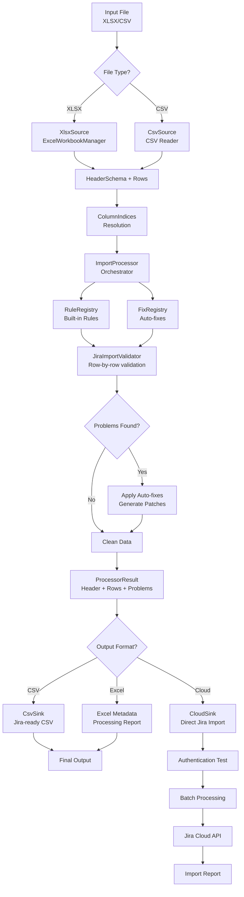
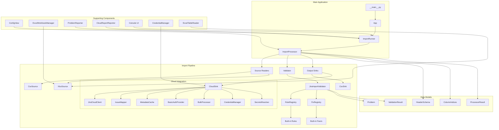
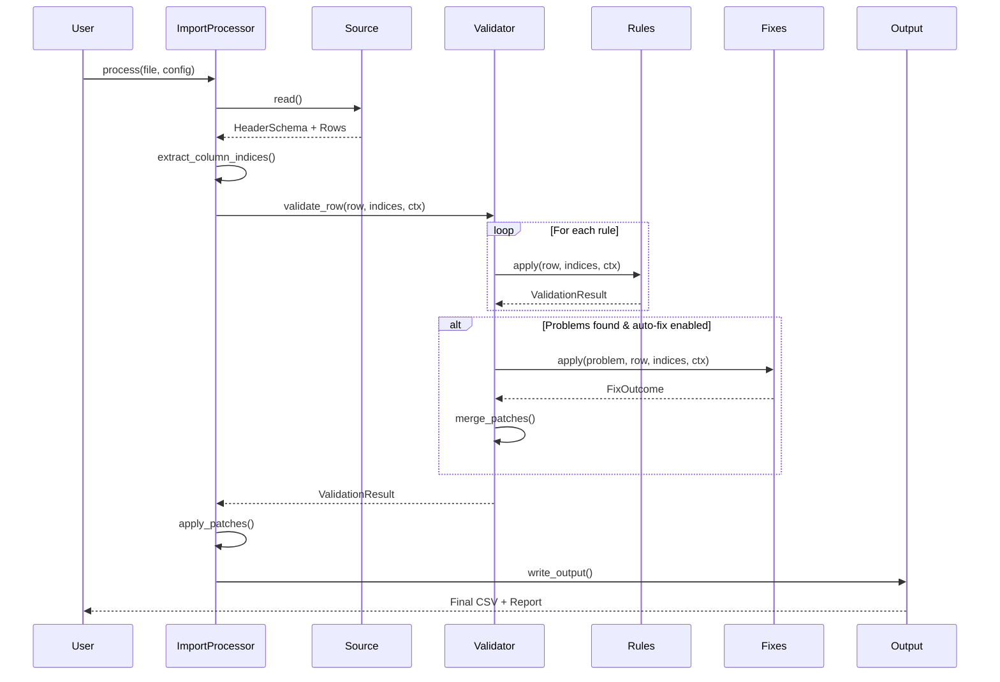
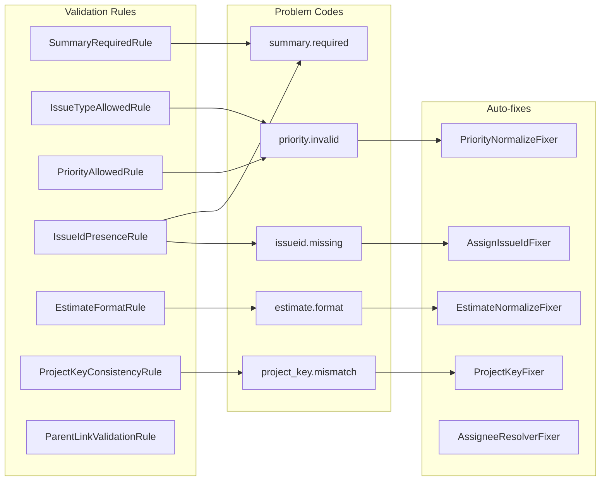
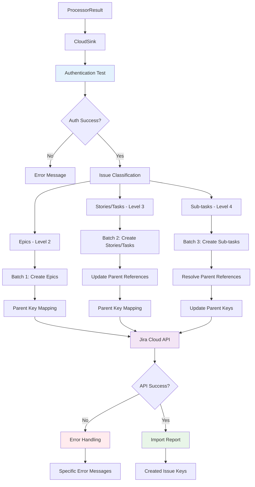

# Architecture Guide

This document provides a comprehensive overview of the Jira Importer Toolkit's architecture, including visual diagrams and detailed component breakdowns.

## 📁 Repository Structure

```text
jira-toolkit/                    # Repository root
├── src/                         # Source code
├── build/                       # Build assets and working dirs
├── dist/                        # Build output
├── resources/                   # Runtime/user resources
├── docs/                        # Documentation
├── scripts/                     # Helper scripts
├── build.py                     # Build script entrypoint
├── requirements.in              # Python dependencies
├── requirements.lock            # Python dependencies with used versions
├── README.md                    # User documentation
└── .venv/                       # Virtual environment
```

## 🏗️ Application Architecture

### Core Application Structure

```text
src/jira_importer/               # Main application package
├── __main__.py                  # Entry point
├── app.py                       # Application logic
├── config/                      # Configuration management
│   ├── config_factory.py       # Configuration factory
│   ├── config_view.py           # Typed config access
│   ├── config_models.py         # Configuration data models
│   ├── config_display.py        # Configuration display utilities
│   ├── excel_config.py         # Excel-based configuration
│   ├── json_config.py          # JSON configuration
│   ├── constants.py            # Configuration constants
│   ├── utils.py                # Configuration utilities
│   └── models/                  # Configuration models
│       └── issuetypes.py        # Issue type hierarchy models
├── excel/                       # Excel processing
│   ├── excel_io.py             # Excel workbook management
│   └── excel_table_reader.py   # Excel table configuration reader
├── import_pipeline/             # Core import processing
│   ├── processor.py             # Main pipeline orchestrator
│   ├── models.py                # Data models and interfaces
│   ├── validator.py             # Validation engine
│   ├── rules/                   # Validation rules
│   ├── fixes/                   # Auto-fix system
│   ├── sources/                 # Input readers (CSV, XLSX)
│   ├── sinks/                   # Output writers
│   ├── reporting.py             # Problem reporting
│   └── cloud/                   # Cloud integration
│       ├── auth.py              # Authentication providers
│       ├── client.py            # HTTP client wrapper
│       ├── credential_manager.py # Credential management
│       ├── secrets.py           # Secrets resolution
│       ├── mappers.py           # Data mapping to Jira format
│       ├── metadata.py          # Jira metadata caching
│       └── bulk.py              # Batch processing utilities
├── fileops.py                   # File operations
├── artifacts.py                 # Artifact management
├── console.py                   # Rich console UI
├── log.py                       # Logging utilities
└── utils.py                     # Utility functions
```

### Folder Structure Visualization

```mermaid
graph TD
    A[jira-toolkit] --> B[src/]
    A --> C[build/]
    A --> D[dist/]
    A --> E[resources/]
    A --> F[docs/]
    A --> G[scripts/]
    A --> H[build.py]
    A --> I[requirements.in]
    A --> J[requirements.lock]
    A --> K[README.md]
    A --> L[.venv/]

    B --> B1[jira_importer/]
    B1 --> B2[__main__.py]
    B1 --> B3[app.py]
    B1 --> B4[config/]
    B1 --> B5[excel/]
    B1 --> B6[import_pipeline/]
    B1 --> B7[fileops.py]
    B1 --> B8[artifacts.py]
    B1 --> B9[console.py]
    B1 --> B10[log.py]
    B1 --> B11[utils.py]

    B4 --> B4A[config_factory.py]
    B4 --> B4B[config_view.py]
    B4 --> B4C[config_models.py]
    B4 --> B4D[config_display.py]
    B4 --> B4E[excel_config.py]
    B4 --> B4F[json_config.py]
    B4 --> B4G[constants.py]
    B4 --> B4H[utils.py]
    B4 --> B4I[models/]

    B5 --> B5A[excel_io.py]
    B5 --> B5B[excel_table_reader.py]

    B6 --> B6A[processor.py]
    B6 --> B6B[models.py]
    B6 --> B6C[validator.py]
    B6 --> B6D[rules/]
    B6 --> B6E[fixes/]
    B6 --> B6F[sources/]
    B6 --> B6G[sinks/]
    B6 --> B6H[reporting.py]
    B6 --> B6I[cloud/]

    B6D --> B6D1[registry.py]
    B6D --> B6D2[builtin_rules.py]
    B6D --> B6D3[excel_rule_loader.py]

    B6E --> B6E1[registry.py]
    B6E --> B6E2[builtin_fixes.py]

    B6F --> B6F1[csv_source.py]
    B6F --> B6F2[xlsx_source.py]

    B6G --> B6G1[csv_sink.py]
    B6G --> B6G2[cloud_sink.py]
    B6G --> B6G3[sink_utils.py]

    B6I --> B6I1[__init__.py]
    B6I --> B6I2[auth.py]
    B6I --> B6I3[bulk.py]
    B6I --> B6I4[client.py]
    B6I --> B6I5[constants.py]
    B6I --> B6I6[credential_manager.py]
    B6I --> B6I7[mappers.py]
    B6I --> B6I8[metadata.py]
    B6I --> B6I9[secrets.py]

    C --> C1[configs/]
    C --> C2[icons/]
    C --> C3[version/]
    C --> C4[temp/]

    C1 --> C1A[dev.json]
    C1 --> C1B[shipping.json]

    C3 --> C3A[generate_version.py]
    C3 --> C3B[build-counter.json]

    E --> E1[templates/]
    E1 --> E1A[ImportTemplate.xlsx]
    E1 --> E1B[config_importer.json]
    E1 --> E1C[jira-config.json]

    F --> F1[DEV.md]
    F --> F2[CONFIG.md]
    F --> F3[ARCHITECTURE.md]
    F --> F4[CLOUD.md]
    F --> F5[CONTRIBUTING.md]
    F --> F6[FEATURES.md]

    G --> G1[demo/]
    G --> G2[git-config.sh]
    G --> G3[git-config.bat]

    G1 --> G1A[demo_console.py]

    style A fill:#e1f5fe
    style B fill:#f3e5f5
    style B4 fill:#e8f5e8
    style B5 fill:#e8f5e8
    style B6 fill:#e8f5e8
    style C fill:#fff3e0
    style E fill:#fce4ec
    style F fill:#f1f8e9
    style G fill:#e0f2f1
```



## 🔄 Import Pipeline Architecture

### Import Pipeline Flow



### Component Architecture



### Data Flow Through Validation



### Rule and Fix System



## 🔧 Component Details

### Import Pipeline (`import_pipeline/`)

The main processing logic - handles validation, fixes, and data transformation:

- **`processor.py`** - Main orchestrator that handles the entire flow
- **`models.py`** - Data structures and interfaces for the pipeline
- **`validator.py`** - Runs validation rules and auto-fixes
- **`rules/`** - Validation rules (built-in + extensible for Excel-defined rules)
- **`fixes/`** - Auto-fix system for common issues
- **`sources/`** - Input readers for CSV and XLSX files
- **`sinks/`** - Output writers (CSV, cloud integration)
- **`reporting.py`** - Rich problem reporting with emojis and tables

### Configuration System (`config/`)

- **`config_factory.py`** - Unified configuration loading from multiple sources
- **`config_view.py`** - Typed configuration access with validation
- **`config_models.py`** - Configuration data models and structures
- **`config_display.py`** - Configuration display utilities
- **`excel_config.py`** - Excel-based configuration handling
- **`json_config.py`** - JSON configuration file processing
- **`constants.py`** - Configuration constants
- **`utils.py`** - Configuration utilities
- **`models/issuetypes.py`** - Issue type hierarchy models

### Excel Processing (`excel/`)

- **`excel_io.py`** - Enhanced Excel workbook management
- **`excel_table_reader.py`** - Structured table configuration reader
- Direct XLSX processing (no intermediate CSV conversion)
- Metadata writing and processing reports

### Console UI (`console.py`)

- Rich console output with tables and formatting
- Progress bars and user interaction
- Consistent theming and styling

### File Operations (`fileops.py`)

- Excel to CSV conversion (legacy path)
- File path management
- Output file generation

### Logging (`log.py`)

- Structured logging with colorama support
- Debug mode support
- Configurable log levels

### Cloud Integration (`import_pipeline/cloud/`)

- **`auth.py`** - Authentication providers (Basic Auth fully implemented; OAuth 2.0 scaffolded but not functional)
- **`client.py`** - HTTP client wrapper for Jira Cloud REST API v3
- **`credential_manager.py`** - Advanced credential management with keyring integration
- **`secrets.py`** - Secrets resolution (keyring → env → config → prompt)
- **`mappers.py`** - Data mapping from normalized rows to Jira issue payloads
- **`metadata.py`** - Jira metadata caching (projects, fields, issue types)
- **`bulk.py`** - Batch processing utilities for efficient imports
- **`constants.py`** - Cloud-specific constants and configuration

## 🚀 Key Design Principles

### Immutability

- Rules and fixes return patches instead of mutating data in-place
- Data flows through the pipeline without side effects
- Safe for concurrent processing and debugging

### Extensibility

- Clean interfaces for adding new rules and fixers
- Plugin-like architecture for future enhancements
- Configuration-driven behavior

### Separation of Concerns

- Clear boundaries between validation, fixing, and output
- Each component has a single responsibility
- Easy to test and maintain individual components

### Performance

- Efficient processing with sparse patches
- Minimal memory overhead
- Scalable for large datasets

## 🔮 Future Architecture Considerations

### Planned Extensions

- Excel-defined validation rules ✅ **Implemented**
- Direct Jira Cloud API integration ✅ **Implemented**
- Batch processing capabilities ✅ **Implemented**
- Import templates for common project types
- OAuth 2.0 authentication (scaffolded, not yet functional - only Basic Auth is currently supported)
- Advanced credential management ✅ **Implemented**

### Recent Improvements

#### Enhanced Security and Error Handling

The toolkit has been significantly improved with security enhancements and better error handling:

- **Path Validation**: New constants module with ASCII control character limits and maximum relative path length
- **Sensitive Data Redaction**: Automatic redaction of sensitive information in logs using RedactingFilter
- **Phased Error Handling**: Custom exceptions and safer Excel metadata writing
- **Improved Error Messages**: Better error logging for import failures with specific guidance

#### Enhanced Excel Configuration

- **Improved Type Conversion**: Better handling of Excel configuration reading with fallback logic
- **Configuration Display Fixes**: Fixed display of Excel configuration table values (CfgAutofieldValues)
- **Fallback Logic**: Added fallback logic to search all column pairs for configuration keys

#### New Development Features

- **Dry-run Mode**: New debug option to show configuration without requiring an input file
- **Configuration Display**: Ability to show configuration without input file using `--show-config`
- **Better Exception Handling**: Narrowed broad exception handlers for payload write and JSON parsing

#### Enhanced Authentication Error Handling

The cloud sink now provides comprehensive error handling for authentication and connection issues:

- **Pre-flight authentication testing** using `/myself` endpoint
- **Specific error messages** for different HTTP status codes (401, 403, 404, 429, 5xx)
- **Network error detection** for timeouts, DNS failures, and SSL issues
- **Malformed response handling** with graceful fallback
- **Clear user guidance** with actionable error messages

#### Configuration Loading Improvements

- **Fixed config parameter precedence** - `--config` parameter now properly overrides smart defaults
- **Better error messages** for configuration loading issues
- **Support for both old and new issue type configurations**

#### New Cloud Integration Features

- **Credential Management**: Advanced credential resolution with keyring integration
- **OAuth 2.0 Support**: Scaffolded OAuth 2.0 authentication with Basic Auth fallback
- **Excel Table Configuration**: Support for structured configuration tables in Excel
- **Hierarchical Issue Types**: Full support for parent-child relationships
- **Batch Processing**: Efficient handling of large imports with proper ordering

#### New Command Line Features

- **`--credentials`**: Interactive credential management (run/show/clear)
- **`--auto-fix`**: Enable automatic fixing of common validation issues
- **`--fix-cloud-estimates`**: Apply Jira Cloud ×60 estimate quirk
- **`--enable-excel-rules`**: Load validation rules from Excel tables
- **`--data-sheet`**: Specify custom data sheet name

For detailed technical information about the cloud integration, see **[CLOUD.md](CLOUD.md)**.

### Cloud Integration Flow



### Scalability

- The pipeline is designed for easy extension
- Maintain backward compatibility where possible
- Consider performance for large datasets
- Plan for API integration features

:_GeneratedFile_
