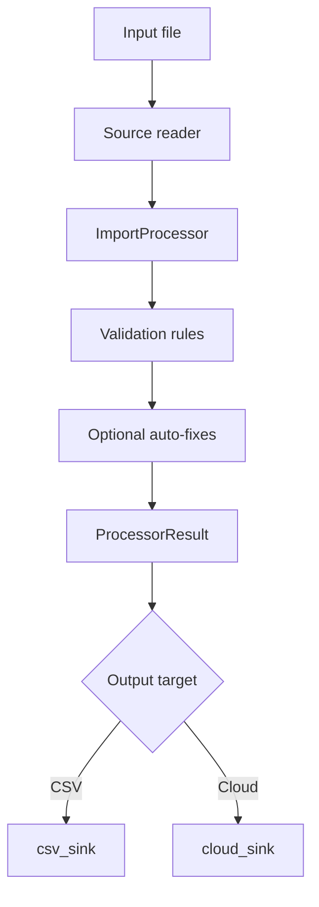

# Architecture Guide

This document describes the current system shape at a high level.

## Repository Map

```text
jira-toolkit/
├── src/jira_importer/        # Application package
├── tests/                    # Unit and integration tests
├── resources/templates/      # Import template and JSON config templates
├── build/configs/            # Build configuration inputs
├── docs/                     # Documentation
├── pyproject.toml            # Packaging and runtime constraints
└── build.py                  # Build entrypoint
```

## Runtime Pipeline


```mermaid
flowchart TD
    A[Input file] --> B[Source reader]
    B --> C[ImportProcessor]
    C --> D[Validation rules]
    D --> E[Optional auto-fixes]
    E --> F[ProcessorResult]
    F --> G{Output target}
    G -->|CSV| H[csv_sink]
    G -->|Cloud| I[cloud_sink]
```

- Source readers normalize input rows from XLSX/CSV.
- `ImportProcessor` coordinates validation, optional fixes, and sink dispatch.
- Rules report problems and patches; fixers apply safe corrections when enabled.
- Sinks produce CSV output or perform Jira Cloud submission.

## Main Modules

- `src/jira_importer/app.py`: CLI parsing and runtime options.
- `src/jira_importer/import_pipeline/processor.py`: orchestration entrypoint.
- `src/jira_importer/import_pipeline/validator.py`: rules and fix application.
- `src/jira_importer/import_pipeline/sinks/csv_sink.py`: CSV output.
- `src/jira_importer/import_pipeline/sinks/cloud_sink.py`: Jira Cloud submission.
- `src/jira_importer/config/`: config loading and normalized config access.
- `src/jira_importer/excel/`: Excel workbook and table readers.

## Validation And Fix Architecture

- Validation is row-oriented and patch-based (no in-place mutation).
- Rules live under `src/jira_importer/import_pipeline/rules/`.
- Fixers live under `src/jira_importer/import_pipeline/fixes/`.
- Problem reporting and aggregation live in `src/jira_importer/import_pipeline/reporting.py`.

## Cloud Integration Shape

- Cloud sink orchestration: `src/jira_importer/import_pipeline/sinks/cloud_sink.py`
- API client and auth: `src/jira_importer/import_pipeline/cloud/client.py`, `auth.py`
- Secrets and credentials: `secrets.py`, `credential_manager.py`
- Payload mapping and metadata: `mappers.py`, `metadata.py`
- Batch behavior: `bulk.py`

## Extension Points

- New validation behavior: add a rule and register it in the rule registry.
- New auto-fix behavior: add a fixer and register by problem code.
- New output behavior: update sink implementation while preserving sink parity expectations.
- New config behavior: implement in `config/` and keep precedence consistent with CLI.

## Design Constraints

- Rules and fixers do not mutate input rows in place; they return patches.
- Cloud sink and CSV sink should maintain feature parity where applicable.
- Secret resolution order is keyring, environment, config, then prompt.

## Source Of Truth

Use these files as canonical references:

- CLI flags and defaults: `src/jira_importer/app.py`
- Build profiles and behavior switches: `build/configs/profiles.json`
- Runtime dependency and Python constraints: `pyproject.toml`
