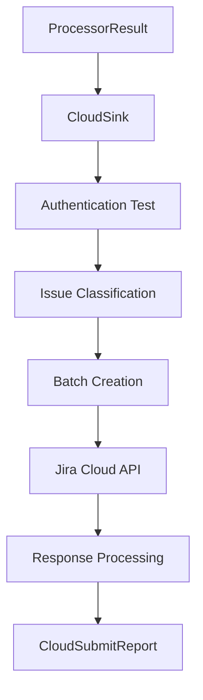
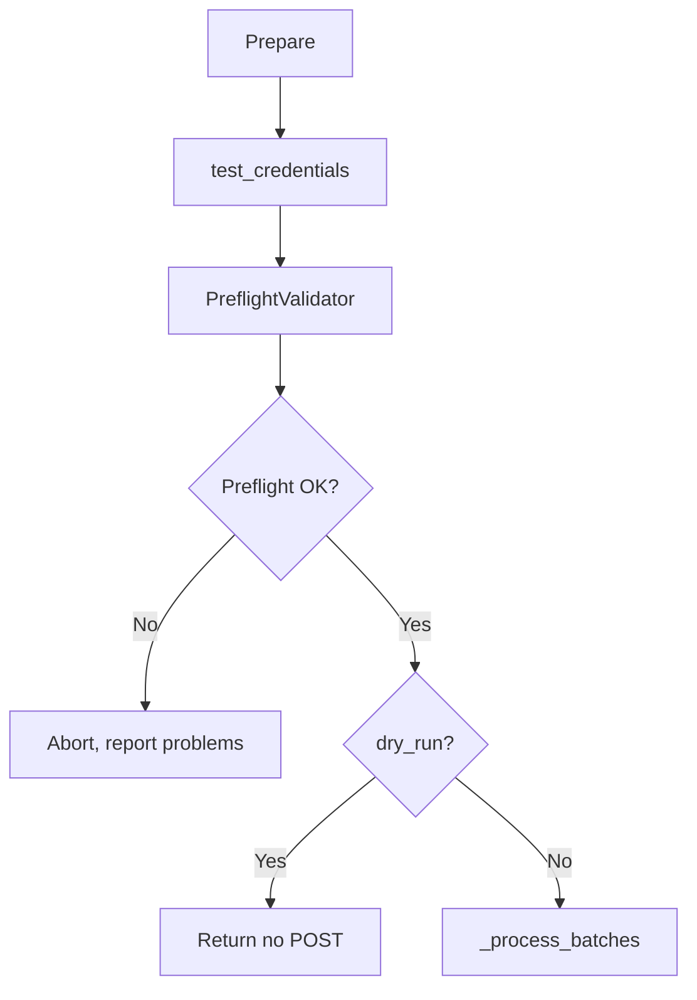

# Jira Cloud Integration

This document covers the technical implementation of Jira Cloud API integration, including authentication, error handling, and batch processing.

## Overview

The Jira Cloud integration provides direct import capabilities to Jira Cloud instances via the REST API v3. It includes comprehensive error handling, batch processing, and hierarchical issue type support.

## Architecture

### Core Components

```text
src/jira_importer/import_pipeline/
├── sinks/
│   └── cloud_sink.py              # Main cloud integration orchestrator
└── cloud/
    ├── client.py                  # HTTP client wrapper
    ├── auth.py                    # Authentication providers
    ├── mappers.py                 # Data mapping to Jira format
    ├── metadata.py                # Jira metadata caching
    ├── preflight.py               # Preflight validation (API refs before POST)
    ├── bulk.py                    # Batch processing utilities
    └── constants.py               # Cloud-specific constants
```

### Data Flow



## Preflight Validation

Before sending any `POST issue/bulk` requests, the cloud sink performs **preflight validation** against the Jira API. This prevents partial imports (some issues created, others rejected) that can cause duplicates on retries.

### CLI Behavior

| CLI       | Behavior                                             |
| --------- | ---------------------------------------------------- |
| `--dry-run` (no `--cloud`) | Local validation only, no Jira connection |
| `--cloud --dry-run`       | Preflight against Jira API; no payload sent          |
| `--cloud`                 | Preflight first; if no criticals, send payload       |

### What Is Validated (Phase 1)

Preflight checks the following references against the Jira API:

- **Project**: Project key from rows or `jira.project.key` config
- **Priorities**: Priority names in rows
- **Issue types**: Issue type names in rows
- **Assignees**: Assignee account IDs
- **Reporters**: Reporter account IDs

**Optional columns:** If a column index is `None` (column not present), that check is skipped ("no column, no check").

### Limitations

- **Custom field values**: Not pre-validated in Phase 1. Invalid custom field values may still cause API errors at import time.
- **`-cl -dr` with local criticals**: If local validation has critical problems, `--cloud --dry-run` still connects and runs preflight. Both local and preflight problems are surfaced.

### Preflight Flow



## Authentication

### Pre-flight Testing

Before starting any import operations, the system performs a pre-flight authentication test:

```python
# Test authentication before proceeding
test_response = client.get("/myself")
if test_response.status_code == HTTP_OK:
    user_info = test_response.json()
    logger.info(f"Authentication successful - connected as: {user_info.get('displayName', 'Unknown')}")
```

### Authentication Providers

Currently supports Basic Authentication (OAuth 2.0 is scaffolded but not functional):

```python
from ..cloud.auth import BasicAuthProvider

client = JiraCloudClient(
    base_url=f"{base_url.rstrip('/')}/rest/api/3",
    auth_provider=BasicAuthProvider(email=email, api_token=api_token)
)
```

### Error Handling

The system provides specific error messages for different authentication scenarios:

| **HTTP Status** | **Error Message** | **User Action** |
|-----------------|-------------------|-----------------|
| 401 | Token expired | Refresh token at profile page |
| 403 | Invalid token/permissions | Check token and project access |
| 404 | Wrong site address | Verify site_address configuration |
| 429 | Rate limit exceeded | Wait and retry |
| 5xx | Server error | Contact Jira administrator |

## Issue Type Hierarchy

### Configuration

Issue types are configured with hierarchical levels:

```json
{
  "jira": {
    "issuetypes": [
      {"name": "Initiative", "level": 1},
      {"name": "Epic", "level": 2},
      {"name": "Story", "level": 3},
      {"name": "Task", "level": 3},
      {"name": "Bug", "level": 3},
      {"name": "Sub-Task", "level": 4}
    ]
  }
}
```

### Level Relationships

- **Level 1 (Initiative)**: Can parent levels 2, 3, 4
- **Level 2 (Epic)**: Can parent levels 3, 4
- **Level 3 (Story/Task/Bug)**: Can parent level 4
- **Level 4 (Sub-Task)**: Cannot parent, must have parent

### Backward Compatibility

The old format is still supported:

```json
{
  "jira": {
    "validation": {
      "issue_types": ["Epic", "Story", "Task", "Sub-task", "Bug"]
    }
  }
}
```

## Batch Processing

### Processing Order

Issues are processed in a specific order to handle parent-child relationships:

1. **Epics** (Level 2) - Created first as standalone issues
2. **Stories & Tasks** (Level 3) - Created with parent references to Epics
3. **Sub-tasks** (Level 4) - Created with parent references to Stories/Tasks

### Batch Size

```python
BATCH_SIZE = 50  # Issues per batch
```

### Error Handling in Batches

Each batch includes comprehensive error handling:

```python
if resp.status_code == HTTP_UNAUTHORIZED:
    error_msg = "Authentication failed (HTTP 401) - your API token may have expired"
    logger.error(error_msg)
    raise ValueError(error_msg)
elif resp.status_code == HTTP_FORBIDDEN:
    error_msg = "Authentication failed (HTTP 403) - your API token may be invalid or you lack permissions"
    logger.error(error_msg)
    raise ValueError(error_msg)
# ... additional status code handling
```

## Data Mapping

### Issue Mapper

The `IssueMapper` class handles conversion from processed rows to Jira issue payloads:

```python
class IssueMapper:
    def __init__(self, cfg: ConfigView, metadata: MetadataCache):
        self.cfg = cfg
        self.metadata = metadata

    def map_row(self, row: list[str], indices: ColumnIndices) -> dict[str, Any]:
        # Convert row data to Jira issue format
        pass
```

### Custom Fields Mapping

Custom fields are automatically mapped from Excel columns to Jira issue payloads based on their configured type:

```python
def _map_custom_fields(
    self,
    fields: dict[str, Any],
    row: Sequence[Any],
    indices: ColumnIndices,
    custom_configs_by_id: dict[str, CustomFieldConfig],
) -> None:
    """Map custom fields from row data to Jira fields dict."""
    for field_id, col_idx in indices.custom_fields.items():
        cfg = custom_configs_by_id.get(field_id)
        if cfg is None:
            continue

        raw = row[col_idx]
        transformed = self._transform_custom_value(raw, cfg)
        if transformed is not None:
            fields[field_id] = transformed
```

**Value Transformation by Type:**

- **Text fields**: Passed through as string (empty values are skipped)
- **Number fields**: Converted to integer or float based on value
- **Date fields**: Converted to ISO 8601 format (`YYYY-MM-DD`) for Jira API
- **Select fields**: Passed through as string (must match allowed values in Jira)
- **Any fields**: Passed through as-is without any transformation or validation

**Example Mapping:**

```python
# Excel row data
row = ["Fix bug", "High", "Bug", "Important", "5", "2024-12-31"]
# Custom field configs
custom_fields = [
    CustomFieldConfig(name="Notes", id="customfield_10125", type="text"),
    CustomFieldConfig(name="Story Points", id="customfield_10002", type="number"),
    CustomFieldConfig(name="Due Date", id="customfield_10130", type="date"),
]

# Resulting Jira payload
{
    "fields": {
        "summary": "Fix bug",
        "priority": {"name": "High"},
        "issuetype": {"name": "Bug"},
        "customfield_10125": "Important",  # Text field
        "customfield_10002": 5,            # Number field
        "customfield_10130": "2024-12-31"  # Date field (ISO format)
    }
}
```

**Configuration Requirements:**

Custom fields must be configured in either:

- JSON config: `jira.custom_fields` array
- Excel table: `CfgCustomFields` table in Config sheet

The `name` in the configuration must match the Excel column header (case-insensitive).

### Metadata Caching

Jira metadata (projects, issue types, fields) is cached to reduce API calls:

```python
class MetadataCache:
    def __init__(self, client: JiraCloudClient):
        self.client = client
        self._cache = {}

    def get_project_metadata(self, project_key: str) -> dict:
        # Cache and return project metadata
        pass
```

## Error Handling Architecture

### Network Error Detection

```python
error_str = str(e).lower()
if any(keyword in error_str for keyword in ["timeout", "connection", "network", "dns", "ssl"]):
    raise ValueError(
        f"Network connection failed to {base_url}. Please check your internet connection and try again. Error: {e!s}"
    ) from e
```

### Malformed Response Handling

```python
try:
    user_info = test_response.json()
    logger.info(f"Authentication successful - connected as: {user_info.get('displayName', 'Unknown')}")
except (ValueError, KeyError) as json_error:
    logger.warning(f"Authentication successful but received malformed response: {json_error}")
    logger.info("Authentication successful - proceeding with import")
```

### HTTP Status Code Constants

```python
# HTTP status codes for better error handling
HTTP_OK = 200
HTTP_UNAUTHORIZED = 401
HTTP_FORBIDDEN = 403
HTTP_NOT_FOUND = 404
HTTP_TOO_MANY_REQUESTS = 429
HTTP_SERVER_ERROR_START = 500
HTTP_SERVER_ERROR_END = 600
```

## Configuration Loading

### Parameter Precedence

The system now properly respects the `--config` parameter:

```python
# Check if a specific config file was provided (not the default)
elif args.config != DEFAULT_CONFIG_FILENAME:
    # Use specified config file with specific path search
    config_path = find_config_path(args.config, args.input_file, config_specific=True)
    logging.debug(f"Specific config provided: {config_path}")
# Smart default: if input is Excel, try using it as config first
elif args.input_file and Path(args.input_file).suffix.lower() in {".xlsx", ".xlsm"}:
    # ... smart default logic
```

### Configuration Flags

- `-c, --config <file>`: Use specific JSON file
- `-ce, --config-excel`: Use Excel file as config source
- `-ci, --config-input`: Use config next to input file
- `-cd, --config-default`: Use default config

## API Integration

### Jira Cloud Client

```python
class JiraCloudClient:
    def __init__(self, base_url: str, auth_provider: AuthProvider):
        self.base_url = base_url
        self.auth_provider = auth_provider

    def get(self, endpoint: str) -> Response:
        # Make GET request to Jira API
        pass

    def post(self, endpoint: str, json: dict) -> Response:
        # Make POST request to Jira API
        pass
```

### Bulk Issue Creation

```python
def build_bulk_create_payload(issues: list[dict]) -> dict:
    return {
        "issueUpdates": issues
    }
```

## Debugging and Logging

### Debug Payloads

When debug mode is enabled, API payloads are written to JSON files:

```python
def _write_payload_debug(payload: dict[str, Any], batch_num: int, output_dir: Path) -> None:
    debug_file = output_dir / f"jira_cloud_payload_batch_{batch_num:03d}.json"
    with open(debug_file, "w", encoding="utf-8") as f:
        json.dump(payload, f, indent=2, ensure_ascii=False)
```

### Logging Levels

- **INFO**: Authentication success, batch creation progress
- **WARNING**: Malformed responses, non-critical issues
- **ERROR**: Authentication failures, API errors
- **DEBUG**: Detailed request/response information

## Testing

### Unit Tests

```bash
# Run cloud integration tests
python -m pytest tests/unit/test_cloud_sink.py -v
```

### Integration Tests

```bash
# Run end-to-end cloud tests
python -m pytest tests/integration/test_cloud_integration.py -v
```

## Performance Considerations

### Batch Size Optimization

- **Default**: 50 issues per batch
- **Adjustable**: Based on Jira instance performance
- **Error handling**: Individual batch failures don't stop the entire process

### Metadata Caching Performance

- **Project metadata**: Cached for the duration of the import
- **Issue type metadata**: Cached to avoid repeated API calls
- **Field metadata**: Cached for validation and mapping

### Rate Limiting

- **429 handling**: Automatic retry with exponential backoff
- **Request throttling**: Built into the client
- **User guidance**: Clear messages when rate limits are hit

## Security

### API Token Handling

- **No token storage**: Tokens are only held in memory during execution
- **Secure transmission**: HTTPS only for all API calls
- **Token validation**: Pre-flight testing before bulk operations

### Error Message Security

- **No sensitive data**: Error messages don't expose tokens or internal details
- **User guidance**: Clear instructions without revealing system internals
- **Logging**: Sensitive data is redacted in logs

## Future Enhancements

### Planned Features

- **OAuth 2.0 support**: For enterprise Jira instances (currently scaffolded but not functional - only Basic Auth is supported)
- **Retry mechanisms**: Automatic retry for transient failures
- **Progress tracking**: Real-time progress updates for large imports
- **Validation caching**: Cache validation results across runs

### Extensibility

- **Custom mappers**: Support for custom issue type mappings
- **Plugin system**: Extensible authentication providers
- **Webhook support**: Real-time import status updates

## Troubleshooting

### Common Issues

1. **Authentication failures**: Check token expiration and permissions
2. **Rate limiting**: Implement exponential backoff
3. **Network issues**: Handle timeouts and connection failures
4. **Data validation**: Ensure issue types and fields exist in Jira

### Debug Mode

Enable debug mode for detailed logging:

```bash
python -m jira_importer your-data.xlsx --cloud --debug
```

This will:

- Write API payloads to JSON files
- Enable detailed request/response logging
- Show authentication test results
- Provide step-by-step import progress

## API Reference

### CloudSink

```python
def write_cloud(
    result: ProcessorResult,
    config: object,
    *,
    dry_run: bool = False,
    output_dir: Path | None = None,
    ui=None
) -> CloudSubmitReport:
    """Submit processed issues to Jira Cloud in batches."""
```

### CloudSubmitReport

```python
@dataclass
class CloudSubmitReport:
    created: int
    failed: int
    batches: int
    errors: list[dict[str, Any]]
    created_issue_keys: list[str] = field(default_factory=list)
    preflight_problems: tuple[Problem, ...] = field(default_factory=tuple)
```

---

**Note**: This is a developer-focused document. For user documentation, see [CONFIG.md](CONFIG.md) and [README.md](../README.md).

:_GeneratedFile_
